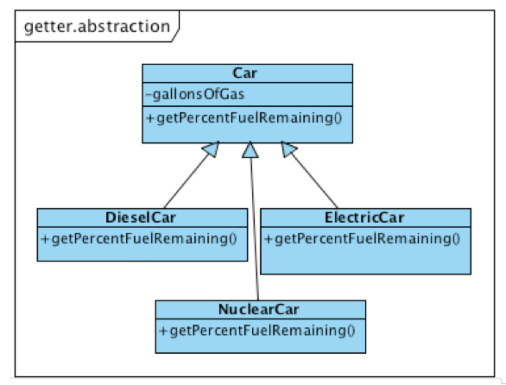
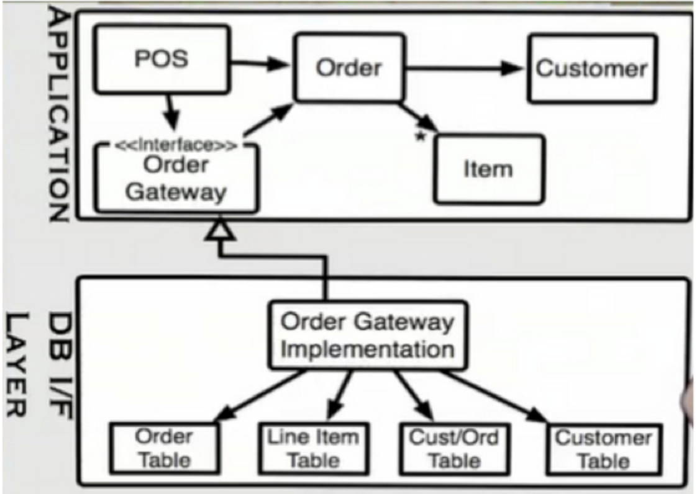

# 7. Form

## Coding Standards

* coding standards는 필요하다. 코드 내에서 명확하게 standards가 보이도록 코드를 작성하자. 코드가 standards의 예로 적합해야 한다.


## Comments should be Rare

* 프로그래머가 필요해서가 아니라 해야 하기 때문에 커멘트를 작성한다면 이런 커멘트는 무의미하고, 무시의 대상이 된다.
* comments should be rare
  * 특별한 경우에만
  * 프로그램의 의도를 위해 반드시 필요할 때만
  * 그 comment를 읽는 모든 사람들이 감사해 할 수 있는 comment를 작성해야 한다.


## Comments are Failures

* 작성자의 의도가 잘 나타나게 프로그램을 작성했다면 comment는 불필요하다.
* 모든 comment는 당신의 코드가 표현력이 좋지 못하는 것을 나타내는, 실패의 상징이다.


## Good Comments

그래도 좋은 comment라 부를 만한 것들이 있다.

* Legal comments
* Informative comments
* Warning of consequences
* TODO comments
* Public API Documentation


## Bad Comments

* Mumbling
* Redundant explanations
* Mandated redundancy
* Journal comments
* Noways comments
* Big banner comments
* Closing brace comments
* Attribution comments
* HTML in comments
* Non-local information: 멀리 떨어진 곳의 코드를 설명하는 comment는 comment와 무관하게 변경될 수 있다. 꼭 작성해야 한다면 코드와 밀접한 곳에 comment를 작성해야 한다.


## Vertical Formatting

* 공란을 함부로 사용하지 마라.
  * 메서드 사이
  * private 변수들과 public 변수들 사이
  * 메서드 내 변수 선언과 메서드 실행의 나머지 부분 사이
  * if / while 블록과 다른 코드 사이
* 서로 관련된 것들은 vertical하게 근접해야 한다. vertical한 거리는 그들간의 관련성을 나타낸다.


## Classes

* 클래스는 private 변수가 있고, 그 private 변수들을 public 함수로 조작한다. 외부에서는 private 변수가 없는 것처럼 보인다.

* 객체의 상태를 외부에서 사용할 수 있도록 getter/setter/property 등을 제공하는 것은 Bad design이다. 변수를 private으로 선언하고 그 변수에 접근할 수 있는 getter/setter를 제공하는 것은 옳지 못하다.

* Tell, Don't Ask: 객체가 관찰되지 않는 state를 가진다면 무엇을 하라고 시키기가 쉽고 ask할 가치가 없어진다. 이 규칙을 지키는 객체의 경우 getter가 많지 않고 그렇기 때문에 setter도 많지 않다.

* cohesion(응집도)을 높여야 한다. getter, setter를 사용하는 경우 cohesion이 낮다. 하나의 변수에만 접근하기 때문! 그렇다고 getter/setter가 없을 수는 없기 때문에 최소화해야 한다. 본래의 변수를 그대로 노출하지 않고 추상화를 통해 제공하자.

* getter를 추상화하여 제공하자.

  

* 내부 변수를 숨기고 상세 구현을 덜 노출시킬수록 polymorphic 클래스를 활용할 기회가 늘어난다. 이런 polymorphic한 구조가 되어야 독립적인 배포가 가능해진다. 

  * 독립적인 컴파일 -> 독립적인 배포

* Polymorphism은 클라이언트 코드를 서버 코드의 구현 변경으로부터 보호할 수 있다.

* 객체지향의 핵심은 **IoC를 통해 High Level Policy(클라이언트, 비즈니스 로직)를 Low Level Detail로부터 보호하는 것**


## Data Structures

* Data structures는 class와 반대되는 개념이다. 

  | class                                          | data structure                     |
  | ---------------------------------------------- | ---------------------------------- |
  | private 변수들 + 이를 다루는 함수들            | pblic 변수들 + getter/setter       |
  | cohesive groups of variables를 조작하는 메서드 | 개별 변수들을 조작 (getter/setter) |
  | 구현을 숨기고 추상화한다                       | 구현을 노출한다                    |
  | Tell이 가능하다                                | Tell은 불가능, Ask만 가능하다      |

* Switch 문장을 보게 될 경우 data structure가 숨어있지 않은지 한 번 확인해 보자

  ```java
  public class Employee {
    public enum Type { HOURLY, SALARIED }
    
    public Type type;
    public String firstName;
    public String lastName;
    public Calendar dob;
    public String ssn;
  }
  
  class Utilities {
    void print(Employee e) {
      switch (e.type) {
        case HOURLY:
          printHourlyEmployee(e);
          break;
        case SALARIED:
          printSalariedEmployee(e);
          break;
      }
    }
  }
  ```

  위와 같은 코드의 문제점이 뭘까! generic한 행위를 수행하라고 test할 수 없다. type에 기반하여 메서드 호출을 해야 한다.

* 이런 식으로 바꿀 수 있을 것이당

  ```java
  public interface Employee {
    public void print();
  }
  
  class HourlyEmployee implements Employee {
    void print() {
      // ,,,
    }
  }
  
  class SalariedEmployee implements Employee {
    void print() {
      // ,,,
    }
  }
  ```

* Data structure는 기능의 추가에 대해서 자유롭고, 객체 지향은 타입의 추가에 자유롭다.

* 각각의 단점을 보완하는 방식으로 Visitor 패턴을 사용할 수 있다. (클린 코드 책 내용 추가)

  


## Boundaries

* 이전 강의들에서 app 파티션과 main 파티션의 분리에 대해 이야기했었다. Main 파티션은 app 파티션의 플러그인이라고 볼 수 있다. 
* Main 파티션은 concrete하고 app 파티션은 abstract하다. concrete(main) -> abstract(app)로의 의존성은 있지만 abstract(app) -> concrete(main)로의 의존성은 존재하지 않는다. (여기서의 의존성은 **소스코드 의존성**을 말한다.)
* 인터페이스 레이어를 가지고 있기 때문에 이런 소스코드 의존성의 관리가 가능하다.
* 소스코드 의존성 <-> 런타임 의존성 (DIP)


## The Impedence Mismatch

* Database table은 class가 아닌, data structure이다. 데이터를 노출하고 메서드는 없다. DB table은 너무나 concrete해서 polymorphic 할 수 없다.

* DB는 도메인 객체, 비즈니스 깩체, 어떤 객체도 포함할 수 없고 오직 DS만 포함한다. 이러한 DS를 객체화하는 것도 불가능하다.

* ORM(Object Relational Mapper)이 있지 않냐!? - 이는 완전한 객체라고 볼 수 없다. Database row와 객체 간의 직접적인 매핑은 없기 때문이다. 이런 ORM이 하는 것은 DB의 DS를 Memory의 DS로 바꿔주는 역할을 하는 것!

* Database는 application을 위해 존재하는 것이 아니라 enterprise를 위해 최적화된다. 하지만 개별 app들은 자기 자신만의 schema를 원할 것이다.

* Application boundary 측면에서 enterprise schema를 객체 설계를 통해 분리할 수 있다. table의 row를 직접 조작하는 대신, 객체를 조작함으로써 application을 보다 자연스럽고 이해하기 쉽게 만든다.

  