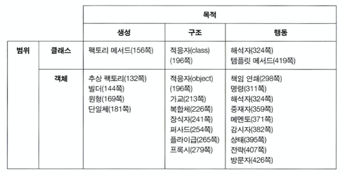
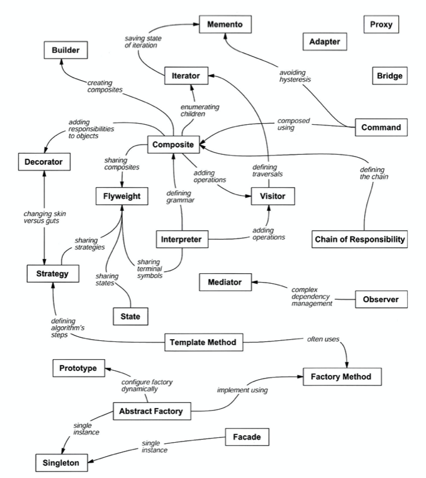

# GoF Design Pattern

강의를 들으며 훅훅 들리는 패턴들을 알아들을 수 없는 나는 정말 속상해

### 생성 패턴

* 추상 팩토리(Abstract Factory): 구체적인 클래스를 지정하지 않고 관련성을 갖는 객체들의 집합을 생성하거나 서로 독립적인 객체들의 집합을 생성할 수 있는 인터페이스를 제공하는 패턴

* 빌더(Builder): 복합 객체의 생성 과정과 표현 방법을 분리하여 동일한 생성 절차에서 서로 다른 표현 결과를 만들 수 있게 하는 패턴

* 팩토리 메서드(Factory Method): 객체를 생성하는 인터페이스는 미리 정의하되, 인스턴스를 만들 클래스의 결정은 서브 클래스 쪽에서 내리는 패턴. 팩토리 메서드 패턴에서는 클래스의 인스턴스를 만드는 시점을 서브 클래스로 미룬다.

* 원형(Prototype): 생성할 객체의 종류를 명세화하는 데에 원형이 되는 예시물을 이용하고, 그 원형을 복사함으로써 새로운 객체를 생성하는 패턴

* 단일체(Singleton): 어떤 클래스의 인스턴스는 오직 하나임을 보장하며, 이 인스턴스에 접근할 수 있는 전역적인 접촉점을 제공하는 패턴

### 구조 패턴

* 적응자(Adapter): 클래스의 인터페이스를 사용자가 기대하는 다른 인터페이스로 변환하는 패턴으로, 호환성이 없는 인터페이스 때문에 함께 동작할 수 없는 클래스들이 함께 작동하도록 해 준다.

* 가교(Bridge): 구현부에서 추상층을 분리하여 각자 독립적으로 변형할 수 있게 하는 패턴

* 복합체(Composite): 객체들의 관계를 트리 구조로 구성하여 부분--전체 계층을 표현하는 패턴. 사용자가 단일 객체와 복합 객체 모두 동일하게 다루도록 한다.

* 장식자(Decorator): 주어진 상황 및 용도에 따라 어떤 객체에 책임을 덧붙이는 패턴. 기능 확장이 필요할 때 서브클래싱 대신 사용할 수 있는 유연한 대안이 될 수 있다.

* 퍼사드(Facade): 서브시스템에 있는 인터페이스 집합에 대해서 하나의 통합된 인터페이스를 제공하는 패턴. 서브시스템을 좀더 사용하기 편하게 만드는 상위 수준의 인터페이스를 정의한다.

* 플라이급(Flyweight): 크기가 작은 객체가 여러 개 있을 때, 공유를 통해 이들을 효율적으로 지원하는 패턴

* 프록시(Proxy): 어떤 다른 객체로 접근하는 것을 통제하기 위해서 그 객체의 대리자(surrogate) 또는 자리채움자(placeholder)를 제공하는 패턴

### 행동 패턴

* 책임 연쇄(Chain of Responsibility): 요청을 처리할 수 있는 기회를 하나 이상의 객체엑 부여하여 요청을 보내는 객체와 그 요청을 받는 객체 사이의 결합을 피하는 패턴. 요청을 받을 수 있는 객체를 연쇄적으로 묶고, 실제 요청을 처리할 객체를 만날 때까지 객체 고리를 따라서 요청을 전달.

* 명령(Command): 요청을 객체의 형태로 캡슐화하여, 서로 요청이 다른 사용자의 매개변수화, 요청 저장 또는 로깅, 그리고 연산의 취소를 지원하게 만드는 패턴

* 해석자(Interpreter): 주어진 언어에 대해, 그 언어의 문법을 위한 표현 수단을 정의하고, 이와 아울러 그 표현 수단을 사용해서 해당 언어로 작성된 문장을 해석하는 해석기를 정의하는 패턴

* 반복자(Iterator): 내부 표현부를 노출하지 않고 어떤 객체 집합에 속한 원소들을 순차적으로 접근할 수 있는 방법을 제공하는 패턴

* 중재자(Mediator): 한 집합에 속해있는 객체들의 상호작용을 캡슐화하는 객체를 정의하는 패턴. 객체들이 서로를 직접 참조하지 않도록 함으로써 객체들 사이의 소결합(loose coupling)을 촉진시키며, 개발자가 객체들의 상호작용을 독립적으로 다양화시킬 수 있게 만든다.

* 메멘토(Memento): 캡슐화를 위배하지 않은 채 어떤 객체의 내부 상태를 잡아내고 실체화시켜, 이후에 해당 객체가 그 상태로 다시 되돌아올 수 있도록 하는 패턴

* 감시자(Observer): 객체 사이에 일 대 다의 의존 관계를 정의해 두어, 어떤 객체의 상태가 변할 때 그 객체에 의존성을 가진 다른 객체들이 그 변화를 통지받고 자동으로 갱신될 수 있게 만드는 패턴.

* 상태(State): 객체의 내부 상태에 따라 스스로 행동을 변경할 수 있게끔 허가하는 패턴. 이렇게 하면 객체는 마치 자신의 클래스를 바꾸는 것처럼 보인다.
* 전략(Strategy): 동일 계열의 알고리즘군을 정의하고, 각각의 알고리즘을 캡슐화하며, 이들을 상호교환이 가능하도록 만드는 패턴. 알고리즘을 사용하는 사용자와 상관없이 독립적으로 알고리즘을 다양하게 변경할 수 있게 한다.

* 템플릿 메서드(Template Method): 객체의 연산에는 알고리즘의 뼈대만을 정의하고 각 단계에서 수행할 구체적 처리는 서브클래스 쪽으로 미루는 패턴. 알고리즘 구조 자체는 그대로 놔둔 채 알고리즘 각 단계의 처리를 서브클래스에서 재정의할 수 있게 한다.

* 방문자(Visitor): 객체 구조를 이루는 원소에 대해 수행할 연산을 표현하는 패턴. 연산을 적용할 원소의 클래스를 변경하지 않고 새로운 연산을 정의할 수 있게 한다.

