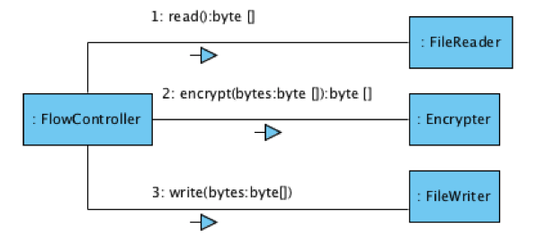
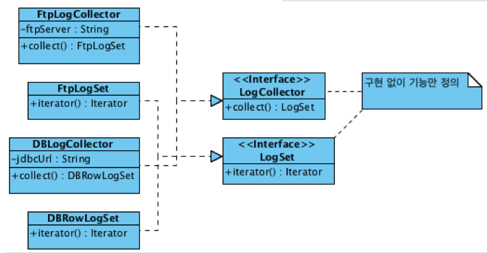

# 1. OOP

## Why OOP

* Procedural 
  * 알아야 할 것이 적어서 초기 진입이 쉽다.
  * 데이터의 변경이 많은 영향을 미친다. - 데이터 변경이 어려움
  * 모든 프로시저가 데이터를 공유한다.
  * 시간이 지날수록 수정하기 어려운 구조
* OOP
  * 데이터와 코드가 캡슐화가 되어 있다. - 필요한 것만 노출시킴
  * 응집도는 높고, 결합도는 낮게.
  * 프로시저를 실행하는데 필요한 만큼의 데이터만 가진다.
  * 데이터의 변경이 해당 객체로만 제한되고 다른 객체에 영향을 미치지 않는다.

## Object / Role / Responsibility

* 객체는 '어떻게'가 아닌 '무엇'으로 정의
* 역할은 관련된 책임의 집합
* 객체는 역할을 가진다.

## 객체지향 설계 과정

1. 기능을 제공할 객체 후보 선별

   

2. 객체 간 메시지 흐름 연결

   

3. 1, 2를 반복

## Encapsulation

내부적으로 어떻게 구현되었는지를 감춰 내부의 변경에 클라이언트가 변경되지 않도록 한다. - 코드 변경에 따른 비용을 최소화한다.

* Tell, Don't Ask
  * 데이터를 요청해서 변경하고 저장하라고 하지 말고, 데이터를 잘 알고 있는 객체에게 기능을 수행하라고 하라.
* Law of Demeter
* Command vs Query
  * Command(Tell): 객체의 내부 상태를 변경, 편이를 위해 어떤 결과를 반환할 수 있다.
  * Query(Ask): 객체의 상태에 대한 정보를 제공. 객체의 상태를 변경하지 않는다.
  * 해당 객체의 외부에서 의사결정에 사용하지 않는다면 객체의 상태를 얻을 수 있다.
  * 해당 객체의 상태에 기반한 결정은 반드시 객체 내에서 이뤄져야 한다.

## Polymorphism

상속을 통해 다형성을 구현한다.

* 구현 상속 (superclass) 
* **인터페이스 상속 (interface)** 🌟

## Abstraction

인터페이스를 이용해서 추상화를 하게 되면 구현 없이 기능만 정의해서 사용이 가능하다. 구체적인 구현체에 의존하지 않고 인터페이스에 의존하게 함으로써 유연성을 얻을 수 있다.

인터페이스를 통한 추상화를 통해 저수준의 로직이 변경되더라도 비즈니스 로직은 영향을 받지 않는다. 이를 통해 유지보수 측면에서 보다 나은 프로그램을 작성할 수 있게 된다. 

위의 예제에서 클라이언트는 `LogCollector`에 의존하고 있다. 이렇게 추상화를 해 두었더라면 구체적인 구현 로직이 변경되더라도 구현체를 변경해주는 방식(ex. `FtpLogCollector`에서 `DBLogCollector`를 사용하는 방식으로 변경)으로 교체의 유연성을 가질 수 있다.

DI가 가능해지기 때문에 테스트에 용이하다.

